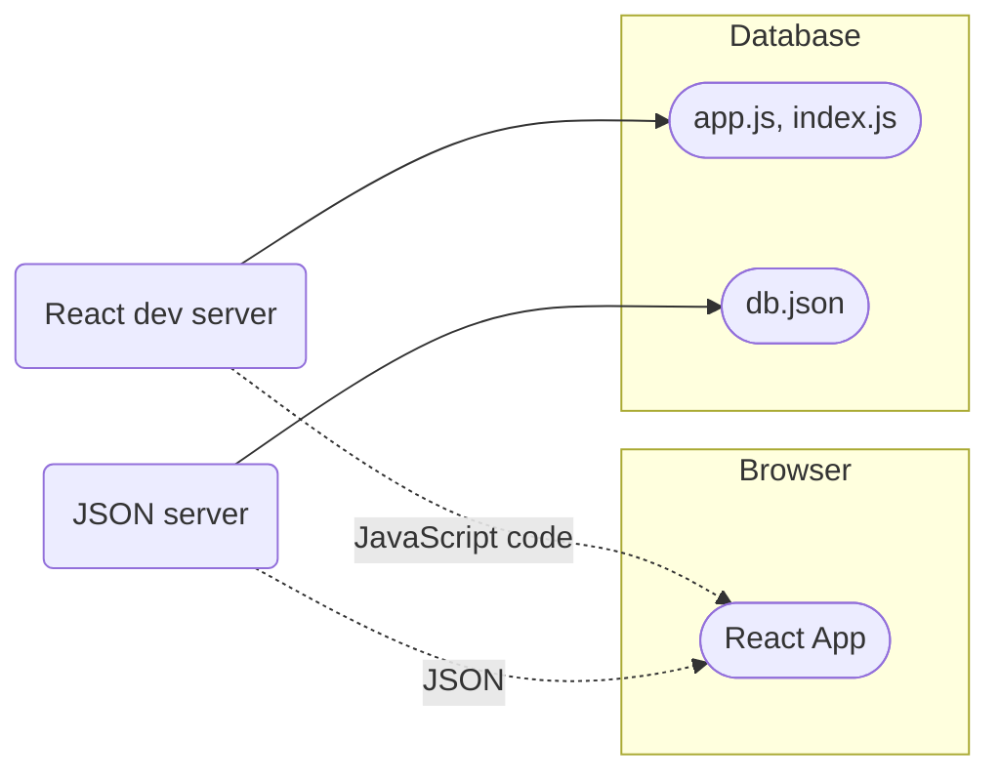

En esta parte del curso se comenzará a usar el backend, es decir, las funcionalidades del lado del servidor. Para ello se creará un servidor usando JSON server. Para ello se crea un archivo llamado *db.json* en el directorio raíz con el siguiente contenido:


```json
{
  "notes": [
    {
      "id": 1,
      "content": "HTML is easy",
      "important": true
    },
    {
      "id": 2,
      "content": "Browser can execute only JavaScript",
      "important": false
    },
    {
      "id": 3,
      "content": "GET and POST are the most important methods of HTTP protocol",
      "important": true
    }
  ]
}
```

Se puede instalar de forma global con el comando

```sh
npm install -g json-server
```

Podemos comenzar a correr el server usando el comando

```sh
json-server --port [[PORT]] --watch db.json
```

Donde `[[PORT]]` representa el puerto donde queremos correr el servidor. Ya que no es necesaria una instalación global, podemos instalar JSON server em la raíz de la aplicación y correrlo con el comando:

```sh
npx json-server --port [[PORT]] --watch db.json
```

Ahora si vamos a la dirección `http://localhost:[[PORT]]/notes` podremos ver lo siguiente:

![[Pasted image 20230701005316.png]]

# El navegador como entorno de ejecución

Lo primero que tenemos que hacer es obtener las notas existentes desde la dirección [http://localhost:3001/notes](http://localhost:3001/notes).
En un ejemplo anterior se usó un objeto XHR, la cual es una técnica introducida en 1999 y que todo navegador ha soportado durante mucho tiempo.

En la actualidad, el uso de XHR ya no es recomendado, y los navegadores actuales soportan ampliamente el método `fetch()` que está basado en promesas en vez del el modelo orientado a eventos de XHR.

El siguiente es un recordatorio del uso de XHR:

```jsx
const xhttp = new XHLHttpRequest();

xhttp.onreadystatechange = function() {
	if (this.readyState == 4 && this.statusResponse == 200) {
		const data = JSON.parse(this.responseText);
		// handle the response that is saved in variable data
	}
}

xhttp.open('GET', "/data.json", true);
xhttp.send();
```

En el principio se registra un event handler en el objeto `xhttp` que representa una solicitud HTTP que será llamada por JavaScript cuando el estado del objeto `xhttp` cambie. Si el cambio en el estado significa que la respuesta a la solicitud ha llegado los datos recibidos serán procesados adecuadamente.

Como se puede ver, el event handler es definido antes de que la solicitud sea enviada, sin embargo, el código el código se ejecuta perfectamente. Esto es porque el código no se ejecuta de forma síncrona, es decir, de arriba a abajo, sino de forma *asíncrona*.

Cuando una operación asíncrona es terminada o, más específicamente, en algún momento después de que se complete, el motor de JavaScript llamará a los event handlers registrados para tal operación. Dado que actualmente los motores de JavaScript son *single-threaded*, es decir, no pueden ejecutar código en paralelo, es necesario el usar un modelo no bloqueante de ejecutar operaciones IO. Sino el navegador se "congelará" hasta que reciba los datos del servidor.

Esto igual puede provocar que el navegador se quede trabado ejecutando código cuya ejecución tome mucho tiempo, esto puede provocar que incluso sea imposible de cerrar la pestaña en algunos navegadores o versiones de estos. Para que el navegador continue siendo *responsivo*, es decir, que continue reaccionando a las operaciones con suficiente velocidad, la lógica del código debe ser tal que ningún cómputo tome mucho tiempo.

# npm

Si bien `fetch` es soportado por la gran mayoría de los navegadores (excepto IE) suele ser más cómodo trabajar con una librería dedicada a la comunicación entre el cliente y el servidor, **axios**. Para esto debemos de usar npm.

El gestor de paquetes de Node (npm) es muy usado para definir proyectos que usan JavaScript, de hecho, los proyectos creados con *Vite* también usan el formato de npm. Esto se puede ver en que los proyectos tienen un archivo *package.json* localizado en la raíz del proyecto:

```json
{
  "name": "phonebook",
  "version": "0.0.0",
  "lockfileVersion": 2,
  "requires": true,
  "packages": {
    "": {
      "name": "phonebook",
      "version": "0.0.0",
      "dependencies": {
        "react": "^18.2.0",
        "react-dom": "^18.2.0"
      },
      "devDependencies": {
        "@types/react": "^18.0.37",
        "@types/react-dom": "^18.0.11",
        "@typescript-eslint/eslint-plugin": "^5.59.0",
        "@typescript-eslint/parser": "^5.59.0",
        "@vitejs/plugin-react": "^4.0.0",
        "eslint": "^8.38.0",
        "eslint-plugin-react-hooks": "^4.6.0",
        "eslint-plugin-react-refresh": "^0.3.4",
        "typescript": "^5.0.2",
        "vite": "^4.3.9"
      }
    },
    "node_modules/@aashutoshrathi/word-wrap": {
      "version": "1.2.6",
      "resolved": "https://registry.npmjs.org/@aashutoshrathi/word-wrap/-/word-wrap-1.2.6.tgz",
      "integrity": "sha512-1Yjs2SvM8TflER/OD3cOjhWWOZb58A2t7wpE2S9XfBYTiIl+XFhQG2bjy4Pu1I+EAlCNUzRDYDdFwFYUKvXcIA==",
      "dev": true,
      "engines": {
        "node": ">=0.10.0"
      }
      // ...
}
```

Al agregar axios a las dependencias el comando `npm install` descarga el código de la librería y lo guarda en la carpeta *node_modules*. Para crear el servidor también debemos de instalar *json-server* como una dependencia de desarrollo, por lo que debemos usar el siguiente comando:

```sh
npm install json-server --save-dev
```

Y se debe de hacer un pequeño agregado a la sección `scripts` del archivo *package.json*:

```json
{
	// ...
	"scripts": {
		// ...
		"server": "json-server -p[[PORT]] --watch db.json"
	}
}
```

Ahora se puede iniciar el servidor desde la raíz del proyecto usando el comando

```sh
npm run server
```

Para evitar problemas es necesario que el puerto no esté ocupado, de ser así habrá un error que nos indicará que el puerto está siendo ocupado por otra aplicación.

# Axios y las promesas

Para esta parte se asumirá que JSON server se aloja en el puerto 3000. Para ejecutar el proyecto y a su vez el servidor es necesario que se usen dos terminales diferentes.

Para usar axios solo debemos de importar la librería como cualquier otra usando una declaración `import`:

```jsx
import axios from "axios";

const promise = axios.get("http://localhost:3000/notes");
console.log(promise);

const promise2 = axios.get("http://localhost:3000/foobar");
console.log(promise2);
```

Si se abre la aplicación en el navegador esto debería de verse en la consola:

![[Pasted image 20230702205426.png]]

Los métodos de axios siempre regresan una promesa. Según la documentación de Mozilla acerca de las promesas:

> Una promesa es un objeto representando la finalización eventual o falla de una operación asíncrona.

En otras palabras, una promesa es un objeto que representa una operación asíncrona. Las promesas pueden tener tres estados:

1. **La promesa está pendiente (`pending`):**
   Significa que el valor final (`fulfilled` o `rejected`) aún no está disponible.
2. **La promesa se ha completado (`fulfilled`):**
   Significa que la operación ha sido completada y el valor final está disponible. Normalmente es una operación exitosa. En algunas ocasiones este estado es llamado "resuelto" (`resolved`).
3. **La promesa se ha rechazado (`rejected`):**
   Significa que un error ha evitado que el valor final sea determinado, lo que generalmente representa una operación fallida.

La primera promesa ha sido "completada", lo que representa una solicitud exitosa. La segunda ha sido rechazada y se nos muestra la razón en la consola. Esto nos dice que la solicitud HTTP fue hecha a una dirección inexistente.

Cuando se desea acceder al resultado de una operación exitosa representada por una promesa se debe de registrar un event handler en la promesa. Esto se hace mediante el uso del método `then()`.

```jsx
const promise = axios.get("http://localhost:3000/notes");

promise.then(response => {
	console.log(response);
});
```

Esto nos imprime lo siguiente en la consola:

![[Pasted image 20230702210346.png]]

Al completarse la promesa, el motor de JavaScript llama el event handler registrado en el método `then()` y le provee un objeto `response` como parámetro. El objeto `response` contiene todos los datos esenciales relacionados a una petición HTTP GET, los que incluyen los datos recibidos (`data`), el código de estado (`status`) y los encabezados (`headers`).

Guardar una promesa en una variable es generalmente innecesario, lo más común es encadenar llamadas al método `then()` de tal forma que sigan directamente:

```jsx
axios.get("http://localhost:3000/notes").then(response => {
	const notes = response.data;
	console.log(notes);
});
```

El callback function toma los datos contenidos en la respuesta, los guarda en una variable y los imprime en la consola. Una forma más legible de formatear los métodos encadenados es poner cada llamada en su propia línea:

```jsx
axios.get("http://localhost:3000/notes")
.then(response => {
	const notes = response.data;
	console.log(notes);
});
```

Los datos que devuelve el servidor son una cadena de texto. Axios se encarga de analizar esta cadena y devolver un array de notas. Esto es posible gracias a que el servidor especificó que el formato de los datos como `application/json; charset=utf-8` usando el header `content-type`. Ahora podemos usar los datos obtenidos desde el servidor.

Podemos solicitar las notas desde el servidor y renderizarlas en en componente `<App />` de la siguiente manera. Sin embargo, este método tiene un gran problema, pues solo renderizará el componente `<App />` cuando la solicitud haya sido completada.

```jsx
axios.get("http://localhost:3000/notes")
.then(response => {
	const notes = response.data;
	ReactDOM.createRoot(
		document.getElementById("root").render(<App notes={notes} />)
	);
});
```

Para evitar esto debemos de mover la solicitud de datos dentro del componente `<App />`.

# Hooks de efectos

Al igual que existen hooks para manejar estados existen hooks para manejar efectos, estos son los hooks de efectos. Estos son definidos como:

> El hook de efectos te permite llevar a cabo efectos secundarios en componentes funcionales. Obtener datos de un servidor, configurar una suscripción y cambiar el DOM manualmente en un componente funcional son ejemplos de efectos secundarios.

Esto es, el hook de efectos es la herramienta correcta para obtener datos desde un servidor.

Una vez que se remueva la solicitud de *index.jsx*, podemos colocarla en el componente `<App />` como se muestra:

```jsx
import { useState, useEffect } from "react";
import axios from "axios";
import Note from "./components/Note";

const App = () => {
	const [notes, setNotes] = useState([]);
	const [newNote, setNewNote] = useState("");
	const [showAll, setShowAll] = useState(true);

	useEffect(() => {
		axios.get("http://localhost:3000/notes")
		.then(response => {
			setNotes(response.data);
		})
	}, []);

	return (
		// ...
	);
}
```

Primero, el  cuerpo de la función que define el componente ejecutado y el componente es renderizado por primera vez. Tras esto, la función dentro de `useEffect()` es ejecutada y se envía una petición al servidor. Una vez que la promesa ha sido resuelta se ejecuta el event handler dentro del método `then()`, se asigna un nuevo valor a `notes` y el componente se re-renderiza mostrando las notas obtenidas.

Podemos escribir el código dentro de `useEffect()` de otra forma:

```jsx
const hook = () => {
	axios.get("http://localhost:3000/notes")
	.then(response => {
		setNotes(response.data);
	})
};

useEffect(hook, []);
```

De esta forma podemos ver que `useEffect()` usa dos parámetros. El primero es una función, el *efecto* en sí.  De acuerdo a la documentación:

> Por defecto, los efectos se ejecutan después de cada renderizado completo, pero se puede elegir ejecutarlo solo cuando ciertos valores han cambiado.

Esto es, un efecto dentro de `useEffect()` es ejecutado en cada renderización del componente. Sin embargo, en el código de ejemplo solo se ejecuta en el primer renderizado.

El segundo parámetro es aquel que especifica cuando se ejecutará el efecto. Existen tres opciones:

1. **Sin valor (`undefined`):**
   Si el parámetro no es definido, el efecto se ejecutará en cada renderizado. Este es el comportamiento predeterminado.
2. **Array vacío (`[]`):**
   Si el parámetro es una array vacío, el efecto se ejecutará solo en el primer renderizado del componente.
3. **Array con dependencias (`[dep1, dep2, dep3, ...]`):**|
   Si el array que se pasa como parámetro contiene uno o más valores, el efecto se ejecutará cada que uno de los valores dentro del array (las dependencias) cambie.

# El entorno de ejecución de desarrollo

La aplicación ahora tiene una configuración más compleja. El siguiente diagrama describe la estructura de la aplicación:



El código que hace nuestra aplicación es ejecutado en el navegador. Este código es obtenido de *React dev server*, que es una aplicación que se ejecuta tras el comando `npm run dev`. Este servidor transforma el código en un formato entendible para el navegador y, entre muchas otras cosas, lo junta en un solo archivo.

La aplicación corriendo en el servidor obtiene datos en formato JSON desde JSON server en el puerto 3000. JSON server obtiene dichos datos del archivo *db.json*.

Si bien en este momento todas las partes de la aplicación residen en la misma máquina (el llamado *localhost*) esta situación cambia cuando la aplicación es subida a internet.