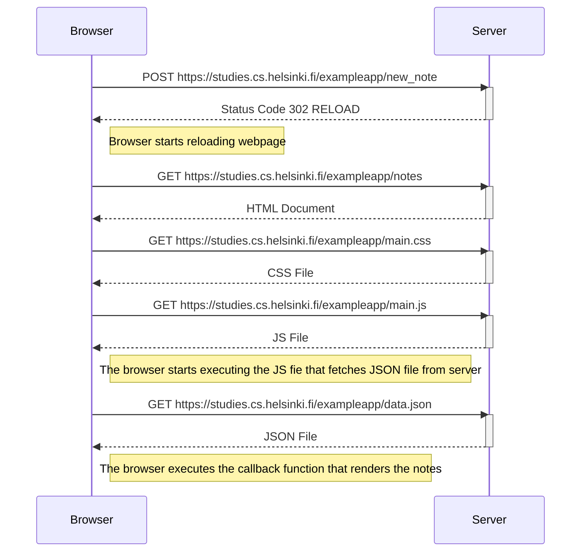
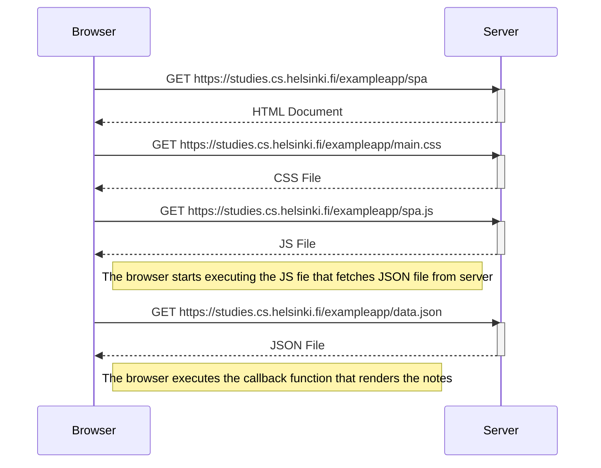
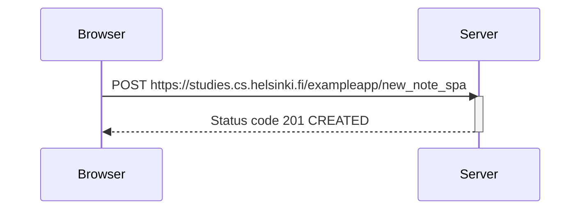

# 0.4: Diagrama para la creación de notas nuevas

Crea un diagrama como el visto en el capítulo para la creación de una nota nueva en la página https://studies.cs.helsinki.fi/exampleapp/notes

*Solución:*

# 0.5 Diagrama de una SPA

Crea un diagrama mostrando la situación cuando el usuario va a la versión SPA de la aplicación de notas en [https://studies.cs.helsinki.fi/exampleapp/spa](https://studies.cs.helsinki.fi/exampleapp/spa).

# 0.6 Diagrama de una nueva nota en una SPA

Crea un diagrama mostrando la situación donde el usuario crea una nueva nota usando la versión SPA de la aplicación.

*Solución:*

