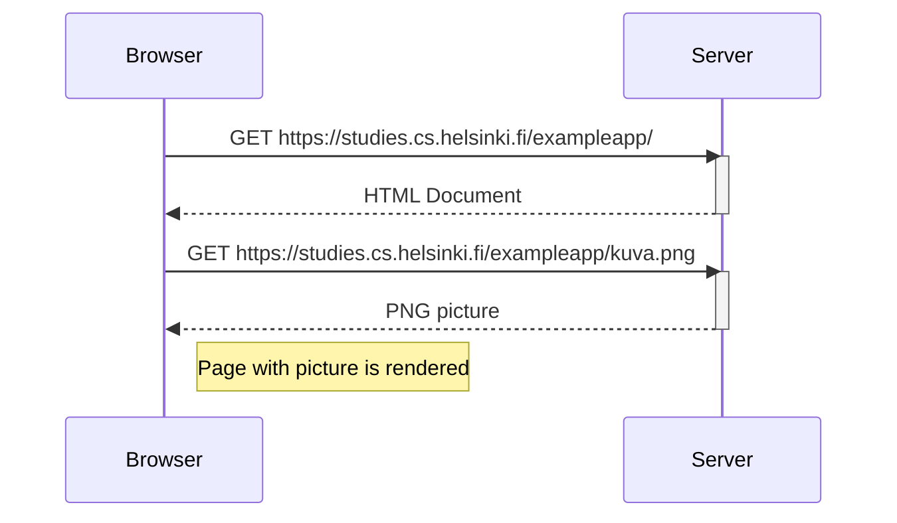
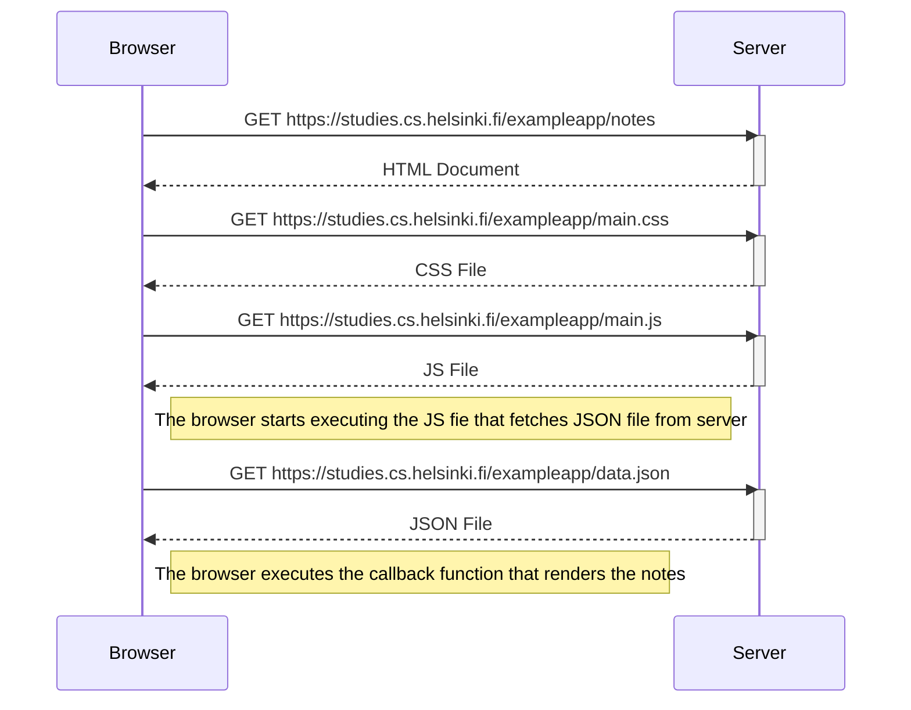

Para comenzar con se usará como ejemplo una aplicación en la siguiente dirección: [[https://studies.cs.helsinki.fi/exampleapp]].

![[Pasted image 20230426232543.png]]

# La primera regla del desarrollo web

A la hora de desarrollar se debe mantener abierta siempre la consola de desarrollador en el navegador. Al abrirla luce de la siguiente manera:

![[Pasted image 20230426232854.png]]

En este caso se está haciendo uso de la pestaña *network*.

# HTTP GET

El servidor y el navegador se comunican mediante el uso del protocolo [[https://developer.mozilla.org/en-US/docs/Web/HTTP|HTTP]], la pestaña *network* muestra el como se comunican. Cuando se recarga la página se puede ver que tres eventos suceden:

- El navegador ha recibido los contenidos de la página desde el servidor.
- Ha descargado la imagen *kuba.png*.
- Ha descargado el ícono *favicon.ico*.

![[Pasted image 20230426235306.png]]

Si se clickea el primer elemento se puede ver información adicional para saber qué es lo que ha pasado:

![[Pasted image 20230427000136.png]]

En *General* se puede observar que el navegador solicita lo que hay en la dirección https://studies.cs.helsinki.fi/exampleapp/ usando el método **GET** y que dicha petición fue exitosa, ya que el servidor respondió con el **[[https://en.wikipedia.org/wiki/List_of_HTTP_status_codes|código de estado]]** 200.

La petición y la respuesta del servidor tiene varios encabezados o **headers**:

![[Pasted image 20230427000618.png]]

Los *response headers* nos dicen el tamaño de la respuesta en bytes y el tiempo exacto de la respuesta. Un header importante es **content-type**, el cual nos dice que la respuesta es un archivo de texto en formato utf-8 y que su contenido está formateado como un HTML. De esta forma el navegador sabe que la respuesta es el archivo HTML regular de una página y que debe renderizarlo como una página normal.

La pestaña *Response* nos muestra los datos de la respuesta, una página HTML común. La sección *body* determina la estructura de la página renderizada en la pantalla:

![[Pasted image 20230427001104.png]]

La página contiene un elemento `<div>` que contiene un encabezado, un link a la página *notes* y una etiqueta ``, por último muestra la cantidad de notas creadas.

Debido a la etiqueta `` el navegador hace una segunda *petición HTTP* para recibir la imagen *kuba.png* del servidor. Los detalles de la solicitud son los siguientes:

![[Pasted image 20230427001630.png]]

Esta vez la solicitud fue hecha a la dirección https://studies.cs.helsinki.fi/exampleapp/kuva.png e igualmente es del tipo HTTP GET. Los headers de la respuesta nos dicen que el tamaño es de 89,350 bytes y su *content-type* es *image/png*, por lo que es una imagen png. El navegador usa esta información para renderizar la imagen correctamente en la pantalla.

La cadena de eventos causada por la visita a la página en el navegador se puede representar con el siguiente diagrama:



El diagrama muestra como el navegador y el servidor se comunican a través del tiempo. El tiemplo fluye de arriba a abajo por lo que el diagrama empieza con la primera petición que el navegador envía al servidor.

Primero el navegador envía una petición HTTP GET al servidor para obtener el código HTML de la página. La etiqueta `` en el HTML hace que el navegador pida la imagen *kuba.png*. Por último, el navegador renderiza la página con la imagen en la pantalla. De hecho, aún si es difícil de ver, la página comienza a renderizarse antes de que la imagen sea recibida desde el servidor.

# Aplicaciones web tradicionales

La página principal de la aplicación de ejemplo funciona como una *aplicación web tradicional*. Cuando se entra en la página el navegador recibe el documento HTML detallando la estructura de la página y el contenido textual de la página desde el servidor.

El servidor ha formado esta documento de alguna manera. Este documento puede ser un archivo de texto *estático* guardado dentro de algún directorio en el servidor. De igual forma, el servidor puede formar este document de forma *dinámica* de acuerdo al código de la aplicación usando, por ejemplo, una base de datos. El código HTML de la aplicación de ejemplo se ha formado de forma dinámica porque contiene información sobre el número de notas.

El código de la página principal es como sigue:

```js [class="line-numbers"]
const getFrontPageHtml = noteCount => {
  return `
    <!DOCTYPE html>
    <html>
      <head>
      </head>
      <body>
        <div class='container'>
          <h1>Full stack example app</h1>
          <p>number of notes created ${noteCount}</p>
          <a href='/notes'>notes</a>
          
        </div>
      </body>
    </html>
`
}

app.get('/', (req, res) => {
  const page = getFrontPageHtml(notes.length)
  res.send(page)
})
```

El contenido de la página web ha sido guardado como una plantilla de texto que permite evaluar el valor de variables como `noteCount` en medio de ella. Dado que el número de notas puede cambiar, este se evalúa cada vez que la página es solicitada, cambiando cada vez que se recargue si este ha cambiado.

# Corriendo la lógica de la aplicación en el navegador

Ahora se irá a la página *notas* de la aplicación. Si se observa la consola se verá que se hicieron cuatro solicitudes HTTP sin contar *favicon.ico*:

![[Pasted image 20230428201710.png]]

Cada una de las solicitudes tiene un tipo diferente. La primera, del tipo *document* es el código HTML de la página que se ve como sigue:

![[Pasted image 20230428201852.png]]

Si lo comparamos con lo que se ve en el navegador podemos ver que el código HTML carece de las notas que se ven en pantalla. Esto es porque la etiqueta `<head>` contiene una etiqueta `<script>` que causa que el navegador solicite un archivo JavaScript llamado *main.js*.

Este archivo se ve de la siguiente manera:

```js
var xhttp = new XMLHttpRequest()
  
xhttp.onreadystatechange = function () {
  if (this.readyState == 4 && this.status == 200) {
    const data = JSON.parse(this.responseText)
    console.log(data)

    var ul = document.createElement('ul')
    ul.setAttribute('class', 'notes')

    data.forEach(function(note){
      var li = document.createElement('li')
      
      ul.appendChild(li);
      li.appendChild(document.createTextNode(note.content))
    })

    document.getElementById("notes").appendChild(ul)
  }
}

xhttp.open("GET", "/exampleapp/data.json", true)
xhttp.send()
```

Inmediatamente después de extraer el contenido de la etiqueta `<script>` comienza a ejecutar el código, el cual en sus últimas dos líneas hace una petición HTTP GET a la dirección del servidor */data.json*:

```js
xhttp.open('GET', '/data.json', true)
xhttp.send()

```

Esta es la última de las solicitudes en la pestaña *Network*.

Si vamos a la dirección a la que se solicita en archivo *data.json* podemos ver las notas como datos crudos en un formato JSON:

![[Pasted image 20230428202707.png]]

Por lo que el código de JavaScript toma este archivo y forma una lista no ordenada a partir de su contenido. Esto es realizado por el siguiente código dentro del ejemplo anterior:

```js
const data = JSON.parse(this.responseText)
console.log(data)

var ul = document.createElement('ul')
ul.setAttribute('class', 'notes')

data.forEach(function(note) {
  var li = document.createElement('li')

  ul.appendChild(li)
  li.appendChild(document.createTextNode(note.content))
})

document.getElementById('notes').appendChild(ul)
```

Este código primero genera una lista no ordenada con la etiqueta `<ul>` 

```js
var ul = document.createElement('ul')
ul.setAttribute('class', 'notes')
```

Y luego agrega una etiqueta `<li>`	para cada nota usando solo el campo *content* de la nota:

```js
data.forEach(function(note) {
  var li = document.createElement('li')

  ul.appendChild(li)
  li.appendChild(document.createTextNode(note.content))
})
```

Dado que el código anterior llama a la consola

```js
const data = JSON.parse(this.responseText)
console.log(data)
```

si la abrimos podremos ver lo siguiente:

![[Pasted image 20230428203242.png]]

# Event handlers y callback functions

Observando el código de la página podemos ver que es algo raro, ya que si bien la solicitud es enviada hasta el final el código de la respuesta se encuentra arriba:

```js
var xhttp = new XMLHttpRequest()

xhttp.onreadystatechange = function() {
  // code that takes care of the server response
}

xhttp.open('GET', '/data.json', true)
xhttp.send() //send request
```

Esto sucede porque se ha creado un *event handler* (manejador de eventos) para el evento *onreadystatechange* para el objeto `xhttp` que hace la petición. Cuando el estado del objeto cambia, el navegador llamará a la función event handler. El código de la función revisa que `readyState` sea igual a 4 (que significa que la operación ha sido completada) y que el código de estado HTTP sea 200.

```js
xhttp.onreadystatechange = function() {
  if (this.readyState == 4 && this.status == 200) {
    // code that takes care of the server response
  }
}
```

El método de invocar event handlers es muy común en JavaScript. A las funciones event handler se les suele llamar callback functions.

# Document Object Model o DOM

Se puede pensar en las páginas web como estructuras de árbol implícitas:

```
  
html
	head
		link
		script
	body
		div
		h1
		div
			ul
		        li
		        li
		        li
		form
	        input
	        input
```

Esta misma estructura puede ser vista en la pestaña *Elements* de la consola:

![[Pasted image 20230429000307.png]]

De hecho, el funcionamiento de los navegadores está basado en la idea de representar los elementos HTML como una especie de árbol, esto es lo que se llama DOM.

El **Document Object Model** o DOM es una *interfaz de programación de aplicaciones* (API) que permite la modificación programática del árbol de elementos de una página web. El siguiente código crea un nuevo nodo `ul` y agrega hijos a él:

```js
var ul = document.createElement('ul')

data.forEach(function(note) {
  var li = document.createElement('li')

  ul.appendChild(li)
  li.appendChild(document.createTextNode(note.content))
})
```

Por último, la rama del árbol `ul` se conecta al lugar donde debe de estar en la página:

```js
document.getElementsByClassName('notes').appendChild(ul)
```

# Manipulando el DOM desde la consola

El nodo más arriba del DOM de un archivo HTML es llamado el objeto `document`. Podemos hacer varias operaciones a la página web usando la DOM-API. Se puede acceder al objeto `document` al escribir `document` en la consola.

![[Pasted image 20230429143905.png]]

Podemos agregar nuevas notas desde la consola. Para ello debemos obtener la lista de notas con el tag `<ul>`:

```js
list = document. getElementByTagName('ul')[0];
```

Y después creamos un nuevo elemento `<li>` y agregar algo de texto como contenido:

```js
newElement = document.createElement('li');
newElement.textContent = 'Page manipulation from console is easy';
```

Y lo agregamos a la lista:

```js
list.appendChild(newElement);
```

![[Pasted image 20230429144604.png]]


Dado que se actualizó la página desde el cliente si se recarga los cambios desaparecerán ya que los cambios no fueron enviados al servidor.

# CSS

El elemento `<head>` del código HTML contiene una etiqueta `<link>` que dice que el navegador debe buscar una hoja de estilos CSS de la dirección *main.css*.

Las hojas de estilo en cascada (cascade style sheets) o CSS, son un lenguaje de estilos que se usa para determinar la apariencia de las páginas web. El archivo que se busca tiene la siguiente apariencia:

```css
.container {
	padding: 10px;
	border: 1px solid;
}

.notes {
	color: blue;
}
```

Este archivo define dos [[https://developer.mozilla.org/en-US/docs/Web/CSS/Class_selectors|selectores de clase]], que son usados para seleccionar ciertas partes de la página y definir el cómo se ven. La definición de un selector de clase siempre empieza con un punto y contiene el nombre de la clase.

Las clases son atributos que se puede agregar a los elementos HTML y pueden ser analizados a través de la consola.

![[Pasted image 20230429145412.png]]

El elemento más exterior tiene la clase *container*, mientras el elemento `ul` que contiene la lista de notas tiene la clase *notes*. La regla define que los elementos con la clase *container* deben ser remarcados con un borde de 1px de grosor, igualmente configura un padding de 10 pixeles agregando cierto espacio entre el borde y su contenido. La segunda clase CSS le da un color azul al texto dentro de la clase *notes*.

Los elementos HTML pueden tener otros atributos aparte de la clase. Por ejemplo, el elemento *div* que contiene a las notas tiene un atributo **[[https://developer.mozilla.org/en-US/docs/Web/HTML/Global_attributes/id|id]]**, este atributo es usado por JavaScript para encontrar al elemento.

# Cargando una página con JavaScript - Resumen

Veamos lo que pasa cuando la página https://studies.cs.helsinki.fi/exampleapp/notes se abre en el navegador.



# Formularios y HTTP POST

En la página igualmente podemos agregar notas enviándolas al servidor, para ello se hace uso de un elemento *form*.

![[Pasted image 20230429151223.png]]

Cuando el botón dentro del elemento *form* es presionado, el navegador enviará el input del usuario al servidor. Esto se puede ver también en la consola en la pestaña de *Network*.

![[Pasted image 20230429151437.png]]

El enviar una nueva nota provoca que se envíen otras cinco peticiones, veamos la petición de la nueva nota.

![[Pasted image 20230429151552.png]]

Podemos ver que es una petición HTTP POST a la dirección del servidor */new_note*. El servidor responde con un código de estado 302, esto es, una redirección a otra URL a la que el servidor le pide que haga una nueva petición HTTP GET. Esta dirección está definida por el campo *location* dentro de los headers de la respuesta, es decir, la dirección */exampleapp/notes*. Esto hace que el navegador recargue la página, lo que provoca las otras cuatro peticiones.

La consola también muestra la información enviada por el formulario:

![[Pasted image 20230429152125.png]]

El formulario también posee atributos `action` y `method` que definen lo que se debe hacer al enviar el formulario. En este caso se usa hace una petición HTTP POST a la dirección *exampleapp/new_note*.

![[Pasted image 20230429152332.png]]

El código en el servidor responsable de las peticiones POST es muy simple.

```js
app.post('/new_note', (req, res) => {
  notes.push({
    content: req.body.note,
    date: new Date(),
  })

  return res.redirect('/notes')
})
```

Los datos son enviados en el cuerpo (`body`) de la petición POST. El servidor accede a estos dados usando `req.body` y crea una nueva nota que agrega a una array de notas.

```js
notes.push({
  content: req.body.note,
  date: new Date(),
})
```

Cada objeto tiene dos campos, *content* es el contenido de la nota y *date* es la fecha y hora en que esta fue creada.

# AJAX

La página de notas sigue un estilo de comienzos de los noventa para el desarrollo web y usa AJAX, por lo tanto, está en el pico de la tecnología web de comienzos de los 2000.

AJAX (Asynchronous JavaScript and XML) es un término introducido en febrero del 2005 para describir una aproximación revolucionaria que permitía hacer solicitudes de contenido web usando JavaScript incluido dentro del HTML sin la necesidad de re-renderizar la página.

Antes de la era AJAX todas las páginas web trabajaban como la aplicación web tradicional, esto es, todos los datos mostrados en la página eran hechos del código HTML solicitado por la página.

La página de notas usa AJAX para obtener los datos de las notas. El envío del formulario aún usa los mecanismos tradicionales de envío.

Esto también se ve reflejado en las URLs. Los datos JSON son obtenidos de la URL https://studies.cs.helsinki.fi/exampleapp/data.json y las nuevas notas son enviadas a https://studies.cs.helsinki.fi/exampleapp/new_note. Hoy en día, tales URLs no son consideradas aceptables porque no siguen las convenciones de [[https://en.wikipedia.org/wiki/Representational_state_transfer#Applied_to_web_services|RESTful APIs]].

# Single page app

En el ejemplo anterior la página principal funciona como una página web tradicional: toda la lógica está del lado del servidor y el navegador solo renderiza el HTML como se le dice.

La página de notas le da cierta responsabilidad al cliente, generando el código HTML a partir de las notas existentes. El navegador toma esta tarea ejecutando el código de JavaScript obtenido del servidor. El código obtiene del servidor los datos JSON ya agrega los elementos HTML para mostrar las notas haciendo uso de la DOM-API.

En años recientes, el estilo de  single page application (SPA) para crear aplicaciones web ha aparecido. Los sitios web estilo SPA no piden todas sus páginas de forma separada al servidor, en su lugar piden un único HTML y después su contenido es manipulado con JavaScript por el navegador.

Si bien la página de notas es muy parecida a una SPA no lo es del todo, ya que si bien, la lógica para renderizar las notas está hecha en el navegador, la página aún usa el modo tradicional de enviar notas: enviar la información al servidor mediante el envío del formulario y luego recargar la página con una redirección.

Una SPA de la aplicación de ejemplo se encuentra en el siguiente link: https://studies.cs.helsinki.fi/exampleapp/spa. Si bien se ve exactamente como la anterior, el código de JavaScript (*spa.js*) es diferente y hay un pequeño cambio en cómo la etiqueta `<form>` está definida.

![[Pasted image 20230429185257.png]]

El formulario no tiene un atributo `action` o `method` para definir cómo y a dónde enviar los datos. Ahora, si abrimos la pestaña *Network* y creamos una nueva nota notaremos que solo se envía una petición al servidor.


![[Pasted image 20230429185634.png]]

La solicitud POST a la dirección *new_note_spa* contiene la nueva nota en formato JSON conteniendo tanto el contenido como la fecha y hora de su creación:

```json
{
	content: "single page app does not reload the whole page"
	date: "Sat Apr 29 2023 17:59:16 GMT-0600 (Central Standard Time)"
}
```

El header *content-type* de la solicitud le dice al servidor que los datos que trae están en formato JSON. Sin este header el servidor no sabría como analizar correctamente los datos.

El servidor responde con el código de estado [[https://httpstatuses.com/201|201]], es decir, ha creado la nueva nota. Esta vez el servidor no pide una redirección, el navegador permanece en la misma página y no envía más peticiones.

La versión SPA de la aplicación no envía datos de la forma tradicional, en su lugar usa código de JavaScript que obtuvo del servidor.

```js
var form = document.getElementById('notes_form')
form.onsubmit = function(e) {
  e.preventDefault()

  var note = {
    content: e.target.elements[0].value,
    date: new Date(),
  }

  notes.push(note)
  e.target.elements[0].value = ''
  redrawNotes()
  sendToServer(note)
}
```

El comando `document.getElementById('notes_form')` le pide al código que obtenga el elemento `<form>` de la página y que registre un *event handler* para manejar el envío del formulario. El event handler inmediatamente llama al método `e.preventDefault()` para prevenir que el comportamiento predeterminado del envío del formulario, es el método predeterminado el que envía los datos al servidor y causa una nueva petición GET, lo que se quiere evitar.

Por último el event handler crea una nueva nota, la agrega a la lista de notas con el comando `notes.push(note)`, re-renderiza la lista de notas y envía la nueva nota al servidor.

El código para enviar las nuevas notas al servidor es el siguiente:

```js
var sendToServer = function(note) {
  var xhttpForPost = new XMLHttpRequest()
  // ...

  xhttpForPost.open('POST', '/new_note_spa', true)
  xhttpForPost.setRequestHeader('Content-type', 'application/json')
  xhttpForPost.send(JSON.stringify(note))
}
```

El código nos dice que los datos deben ser enviados con una petición HTTP POST y los datos en formato JSON.

# Desarrollo Full-stack

Full stack es una palabra que si bien está de moda en el desarrollo web no hay un consenso de lo que significa. Prácticamente todas las aplicaciones tienen dos capas (al menos): el navegador, siendo el lado más cercano al usuario final siendo la capa más externa; y el servidor siendo la más profunda. A veces también hay una capa de bases de datos abajo del servidor. En cierta forma, podemos pensar en la arquitectura de las páginas web como una pila de capas.

Igualmente es común hablar del *frontend* y el *backend*. El navegador es el frontend y el código que corre en este, incluyendo el código de JavaScript son código frontend. El servidor, por otro lado, es el backend.

El desarrollo web full-stack significa que uno debe concentrarse en todas las partes de la aplicación: el frontend, el backend y la base de datos, aunque en algunos casos el software del servidor y su sistema operativo también son vistos como parte del stack.

Para la programación del backend se suele usar el entorno de ejecución Node.js. El usar el mismo lenguaje de programación en diferentes partes del stack permit darle al desarrollo web una nueva dimensión aunque no es un requisito hacerlo.

[[exercises/Parte 0/B. Fundamentos de las páginas web|Problemas de esta sección]]