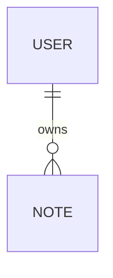

Lo siguiente es agregar la identificación de usuarios a la aplicación. Los usuarios deben ser almacenados en la base de datos y cada nota debe estar vinculada al usuario que la creó, por lo que editar o eliminar una nota solo debería ser posible para el usuario que la creó.

Lo primero es agregar información sobre los usuarios en la base de datos, existe una relación de "uno a varios" (one-to-many) entre el usuario (*User*) y las notas (*Note*).



Si se estuviese usando una base de datos relacional como SQL la implementación sería inmediata, pues cada recurso tendría su propia tabla separada dentro de la base de datos y la id del usuario que creó la nota se almacenaría en las notas como una foreign key.

Al trabajar con bases de datos de documentos como MongoDB la situación es algo diferente, pues existen varias formas de modelar la situación. La solución actual guarda las notas dentro de la colección *notes* en la base de datos, si no queremos hacer ningún cambio a la colección actual lo natural es guardar los usuarios en su propia colección, *users*.

En todas las bases de datos de documentos se pueden usar ids para referir documentos en otras colecciones, esto es similar al uso de foreign keys en las bases de datos relacionales.

Si bien tradicionalmente las bases de datos de documentos como MongoDB no soportan *join queries* que sí están disponibles en otras bases de datos que las usan para agregar datos desde múltiples tablas, desde la versión 3.2 Mongo es capaz de soportar [lookup aggregation queries](https://docs.mongodb.com/manual/reference/operator/aggregation/lookup/).

Si se necesita una funcionalidad similar a las join queries, se pueden implementar en el código múltiples solicitudes. En ciertas ocasiones Mongoose puede encargarse de unir y agregar datos, lo que da la impresión de una join query.

# Referencias a través de colecciones

Si se estuviese usando una base de datos relacional, las notas contendrían una *reference key* del usuario que la creó, en las bases de datos de documentos podemos hacer lo mismo.

Supongamos que la colección *users* contiene dos usuarios:

```json
[
	{
		username: "mluukkai",
		_id: 123456
	},
	{
		username: "hellas",
		_id: 141414
	}
]
```

La colección de notas contiene tres notas que contienen un campo *user* que hace referencia a un usuario en la colección *users*:

```json
[
  {
    content: 'HTML is easy',
    important: false,
    _id: 221212,
    user: 123456,
  },
  {
    content: 'The most important operations of HTTP protocol are GET and POST',
    important: true,
    _id: 221255,
    user: 123456,
  },
  {
    content: 'A proper dinosaur codes with Java',
    important: false,
    _id: 221244,
    user: 141414,
  },
]
```

Las bases de datos de documentos no piden que la foreign key sea guardada en los recursos de notas, por lo que se puede guardar en la colección *users* o incluso en las dos:

```json
[
  {
    username: 'mluukkai',
    _id: 123456,
    notes: [221212, 221255],
  },
  {
    username: 'hellas',
    _id: 141414,
    notes: [221244],
  },
]
```

Dado que los usuarios pueden tener varias notas las ids de las notas están almacenadas en un array en el campo *notes*.

Las bases de datos de documentos también ofrecen una forma completamente diferente de organizar datos, esto es, guardar el array entero de notas como una parte de los documentos de la colección de usuarios lo cual podría ser beneficioso:

```json
[
  {
    username: 'mluukkai',
    _id: 123456,
    notes: [
      {
        content: 'HTML is easy',
        important: false,
      },
      {
        content: 'The most important operations of HTTP protocol are GET and POST',
        important: true,
      },
    ],
  },
  {
    username: 'hellas',
    _id: 141414,
    notes: [
      {
        content:
          'A proper dinosaur codes with Java',
        important: false,
      },
    ],
  },
]
```

En este esquema, las notas estarían dentro de los usuarios y la base de datos no generaría ids para ellas.

La estructura y el esquema de la base de datos no es tan evidente como lo sería con una base de datos relacional, por lo que el esquema escogido debe soportar los casos de uso de la aplicación de la mejor forma posible. Esto no es una decisión de diseño simple, pues no todos los casos de uso de la aplicación no son conocidos cuando la decisión de toma.

Paradójicamente, las bases de datos sin esquema como Mongo requieren que los desarrolladores tomen decisiones de diseño más radicales sobre la organización de los datos al inicio del proyecto que las bases de datos relacionales con esquemas.
# El esquema de Mongoose para los usuarios

En este caso se decidió por guardar las ids de las notas creadas por el usuario dentro del documento del usuario, para ello se tiene que definir el modelo que representará al usuario en el archivo *models/user.ts*:

```ts
const mongoose = require("mongoose");

const userSchema = new mongoose.Schema({
	username: String,
	name: String,
	passwordHash: String,
	notes: [
		{
			type: mongoose.Schema.Types.ObjectId,
			ref: "Note"
		}
	]
});

userSchema.set("toJSON", {
	transform: (document, returnedObject) => {
		returnedObject.id = returnedObject._id.toString();
		delete returnedObject._id;
		delete returnedObject.__v;
		// passwordHash should not be revealed
		delete returnedObject.passwordHash;
	}
});

const User = mongoose.model("User", userSchema);

module.exports = User;
```

Las ids de las notas son guardadas dentro del documento del usuario como un array de ids de Mongo, la definición es la siguiente:

```ts
{
	type: mongoose.Schema.Types.ObjectId,
	ref: "Note"
}
```

El tipo del campo es *ObjectId* que refiere a documentos del tipo *Note*, Mongo no sabe inmediatamente que este es un campo que se refiere a las notas, por lo que la sintaxis está puramente relacionada y definida por Mongoose.

Lo siguiente es expandir el esquema de las notas para que contengan información acerca del usuario que las creó:

```ts
const noteSchema = mongoose.Schema({
	content: {
		type: String,
		required: true,
		minLength: 5
	},
	important: Boolean,
	user: {
		type: mongoose.Schema.Types.ObjectId,
		ref: "User"
	}
});
```

En total contraste con las convenciones de las bases de datos relacionales, *las referencias están guardadas en ambos documentos*: las notas refieren al usuario que las creó y el usuario tiene un array con las referencias de todas las notas que ha creado.

# Creando usuarios

Lo siguiente es implementar una ruta para crear nuevos usuarios. Los usuarios tienen un nombre de usuario único, un nombre y algo llamado *password hash*. El hash de la contraseña es la salida de una [función hash one-way](https://en.wikipedia.org/wiki/Cryptographic_hash_function) aplicada a la contraseña del usuario, ya que no es muy inteligente guardar la contraseña del usuario como texto plano en la base de datos.

Para realizar el hash se debe de instalar el paquete [bcrypt](https://github.com/kelektiv/node.bcrypt.js):

```sh
npm install bcrypt
```

Acorde a las convenciones RESTful, la creación de usuarios debe de hacerse mediante una petición HTTP POST a la ruta de los usuarios.

Por lo tanto, se debe definir un router separado que se haga cargo de los usuarios en el archivo *controllers/users.ts*. No hay que olvidarse de usarlo en la aplicación para que maneje las solicitudes hechas a la URL */api/users*:

```ts
const userRouter = require("./controllers/users");

// ...

app.use("/api/users", usersRouter);
```

El contenido del archivo *controllers/users.ts* es el siguiente:

```ts
const bcrypt = require("bcrypt");
const userRouter = require("express").Router();
const User = require("../models/user");

userRouter.post("/", async (request, response) => {
	const { username, name, password } = request.body;

	const saltRounds = 10;
	const passwordHash = await bcrypt.hash(password, saltRounds);

	const user = new User({
		username,
		name,
		passwordHash
	});

	const savedUser = await user.save();

	response.status(204).json(savedUser);
});

module.exports = usersRouter;
```

La contraseña enviada en la petición no es guardada en la base de datos, en su lugar se guarda el *hash* de la contraseña que se ha generado con la función `bcrypt.hash`.

Se puede aprender más sobre como guardar contraseñas en los siguientes links:

- [Cómo guardar una contraseña de forma segura](https://codahale.com/how-to-safely-store-a-password/)
- [Una nota sobre los rounds](https://github.com/kelektiv/node.bcrypt.js/#a-note-on-rounds)

El código actual no contiene ningún manejo de errores o validación del input para verificar que el nombre de usuario y la contraseña estén en el formato adecuado.

La nueva característica puede y debe ser probada inicialmente de forma manual con una herramienta como Postman, sin embargo, probar las cosas de forma manual se vuelve rápidamente algo tedioso, especialmente cuando se implementa una funcionalidad que require nombres de usuario únicos.

Toma mucho menos esfuerzo escribir pruebas automatizadas y volverá el desarrollo de la aplicación más fácil.

Las pruebas iniciales se pueden ver de la siguiente manera:

```ts
const bcrypt = require("bcrypt");
const User = require("../model/user");

describe("when there is initially one user in db", () => {
	beforeEach(async () => {
		await User.deleteMany({});

		const passwordHash = await bcrypt.hash("sekret", 10);
		const user = new User({ username: "root", passwordHash });

		await user.save();
	});

	test("creation succeeds with a fresh username", async () => {
		const usersAtStart = await helper.usersInDb();

		const newUser = {
			username: "mluukkai",
			name: "Matti Luukkainen",
			password: "salainen"
		};

		await api
			.post("/api/users")
			.send(newUser)
			.expect(201)
			.expect("Content-Type", /application\/json/);

		const usersAtEnd = await helper.usersInDb();
		expect(usersAtEnd).toHaveLength(usersAtStart.length + 1);

		const usernames = usersAtEnd.map(user => user.username);
		expect(usernames).toContain(newUser.username);
	});
});
```

Las pruebas usan la función `usersInDb` que se implementa en el archivo con las funciones de ayuda y ayuda a verificar el estado de la base de datos después de que un nuevo usuario ha sido creado.

El bloque `beforeEach` agrega un usuario con el nombre *root* a la base de datos, con esto se puede crear una prueba que verifique que un usuario con el mismo nombre de usuario no pueda ser creado:

```ts
describe('when there is initially one user in db', () => {
  // ...

  test('creation fails with proper statuscode and message if username already taken', async () => {
    const usersAtStart = await helper.usersInDb();

    const newUser = {
      username: 'root',
      name: 'Superuser',
      password: 'salainen',
    };

    const result = await api
      .post('/api/users')
      .send(newUser)
      .expect(400)
      .expect('Content-Type', /application\/json/);

    expect(result.body.error).toContain('expected `username` to be unique');

    const usersAtEnd = await helper.usersInDb();
    expect(usersAtEnd).toEqual(usersAtStart);
  });
});
```

Dado que esta funcionalidad aún no ha sido implementada la prueba fallará, a escribir las pruebas antes de escribir la funcionalidad se le llama desarrollo conducido por pruebas o [test-driven development](https://en.wikipedia.org/wiki/Test-driven_development), TDD por sus siglas en inglés.

Dado que Mongoose no tiene un verificador integrado para validar la unicidad de un campo se debe usar la librería [mongoose-unique-validator](https://www.npmjs.com/package/mongoose-unique-validator) que se instala de la siguiente manera:

```sh
npm install mongoose-unique-validator
```

Lo siguiente es extender el código del modelo del usuario:

```ts
const uniqueValidator = require("mongoose-unique-validator");

const userSchema = mongoose.Schema({
	username: {
		type: String,
		required: true,
		unique: true
	},
	name: String,
	passwordHash: String,
	notes: [
		// ...
	]
});

userSchema.plugin(uniqueValidator);
```

Lo siguiente es agregar una ruta que regrese los usuarios en la base de datos:

```ts
usersRouter.get("/", async (request, response) => {
	const users = await User.find({});
	response.json(users);
});
```

Para crear nuevos usuarios en un entorno de producción o desarrollo se debe enviar una petición HTTP POST a `/api/users` con el siguiente formato:

```json
{
	username: "root",
	name: "superuser",
	password: "salainen"
}
```

La lista luce de la siguiente manera:

![[Pasted image 20231123115358.png]]

# Creando una nueva nota

El código para crear notas debe ser actualizado para que la nota sea asignada al usuario que la creó, por lo que se debe expandir la implementación del controlador para que la información del usuario sea enviada en el campo `userId` del cuerpo de la solicitud:

```ts
const User = require("../models/user");

notesRouter.post("/", async (request, response) => {
	const body = request.body;

	const user = await User.findById({body.userId});

	const note = new Note({
		content: body.content,
		important: body.important || false;
		user: user.id
	});

	const savedNote = await note.save();
	user.notes = user.notes.concat(savedNote.id);
	await user.save();

	response.status(201).json(savedNote);
});
```

El esquema de las notas también tiene que cambiar de la siguiente manera:

```ts
const noteSchema = mongoose.Schema({
	content: {
		type: String,
		required: true,
		minLength: 5
	},
	important: Boolean,
	user: {
		type: mongoose.Schema.Types.ObjectId,
		ref: "User"
	}
});
```

Es importante notar que el objeto del usuario también cambió, pues se guardó el id de la nota en el array `notes`:

```ts
user.notes = user.notes.concat(savedNote.id);
await user.save();
```

# Populate

Se quiere que la API trabaje de tal forma que, cuando se realice una solicitud HTTP GET a la ruta `/api/users`, el objeto devuelto contenga el contenido de las notas del usuario y no solo sus ids, esto se llama *join query* en una base de datos relacional.

Dado que las bases de datos de documentos no pueden realizar join queries, Mongoose emula esta funcionalidad al realizar múltiples solicitudes.

Las join queries de las bases de datos son *transaccionales*, lo que significa que el estado de la base de datos no cambia durante el tiempo que la solicitud se realiza. Con las join queries de Mongoose nada puede garantizar que el estado entre las colecciones se mantenga consistente, lo que significa que si se hace una solicitud que une al usuario con su colección de notas el estado de la colección puede cambiar durante la solicitud.

Mongoose hace join queries mediante el método [populate](http://mongoosejs.com/docs/populate.html), por lo que hay que actualizar la ruta que devuelve a los usuarios:

```ts
usersRouter.get("/", async (request, response) => {
	const users = await User.find({}).populate("notes");

	response.json(users);
});
```

El método `populate` se encadena después del método `find` que hace la solicitud inicial. El parámetro dado a el método populate define que las ids que están refiriendo objectos nota en el campo *notes* del documento del usuario serán reemplazadas por los documentos nota referidos.

El resultado es prácticamente el que se esperaba:

![[Pasted image 20231123140357.png]]

Se puede usar otro parámetro del método populate para especificar los campos que se desean incluir del documento,  en este caso, el id, content e important. La selección se puede hacer con la sintaxis de Mongo:

```ts
usersRouter.get("/", async (request, response) => {
	const users = await User.find({}).populate("notes", {
		content: 1,
		important: 1
	});

	response.json(users);
});
```

Ahora se devuelve justo la información que se necesita:

![[Pasted image 20231123142840.png]]

Es importante entender que la base de datos no sabe que las ids guardadas en el campo de *user* de la colección de notas hacen referencia a un documento de la colección de usuarios.

La funcionalidad del método populate de Mongoose está basada en el hecho de que se tienen tipos definidos de las referencias en el esquema de Mongoose con la opción ref:

```ts
const noteSchema = new mongoose.Schema({
  content: {
    type: String,
    required: true,
    minlength: 5
  },
  important: Boolean,
  user: {
    type: mongoose.Schema.Types.ObjectId,
    ref: 'User'
  }
});
```

