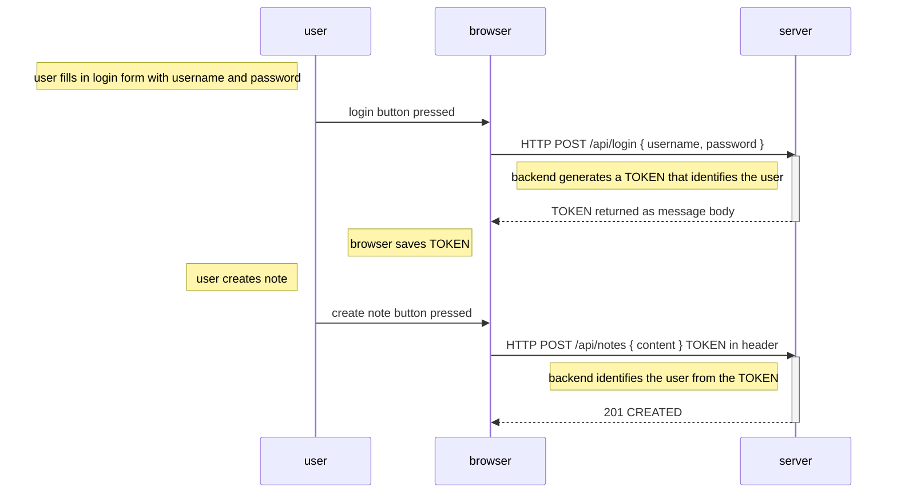

Los usuarios deben ser capaces de iniciar sesión en la aplicación y al hacerlo la información de las notas que ellos crearon debe estar ligada a la información del usuario automáticamente.

Para esto se deben aplicar el soporte de [verificación basada en tokens](https://www.digitalocean.com/community/tutorials/the-ins-and-outs-of-token-based-authentication#how-token-based-works) al back-end. Estos principios siguen el siguiente diagrama:

`classname:scale150`


El inicio de sesión es como sigue:

- El usuario inicia sesión usando el formulario de inicio de sesión implementado con React
- Esto provoca que el código de React envíe el nombre de usuario y la contraseña a la dirección del servidor */api/login* como una solicitud HTTP POST.
- Si el nombre de usuario y la contraseña son correctos, el servidor genera un *token* que de alguna manera identifica al usuario que ha iniciado sesión.
	- El token está firmado digitalmente, haciendo imposible que se falsifique.
- El back-end responde con el código de estado indicando que la operación es exitosa y regresa el token como respuesta.
- El navegador guarda el token, por ejemplo, como el estado de una aplicación de React.
- Cuando el usuario crea una nota (o realiza cualquier otra operación que requiere verificación) el código de React envía el token al servidor con la solicitud.
- El servidor usa el token para identificar al usuario.

Lo primero es implementar la funcionalidad para iniciar sesión. Para ello se usará la librería [jsonwebtoken](https://github.com/auth0/node-jsonwebtoken), la que permite generar [JSON web tokens](https://jwt.io/):

```sh
npm install jsonwebtoken
```

El código para la funcionalidad de inicio de sesión va en el archivo *controller/login.ts*:

```ts
const jwt = require("jsonwebtoken");
const bcrypt = require("bcrypt");
const loginRouter = require("express").Router();
const User = require("../models/user");

loginRouter.post("/", async (request, response) => {
	const { username, password } = request.body;

	const user = await User.findOne({ username });
	const passwordCorrect = user === null
		? false
		: await bcrypt.compara(password, user.passwordHash);

	if (!(user && passwordCorrect)) {
		return response.status(401).json({
			error: "invalid username or password"
		});
	}

	const userForToken = {
		username: user.username,
		id: user._id
	};

	const token = jwt.sign(userForToken, process.env.SECRET);

	response
		.status(200)
		.send({ token, username: user.username, name: user.name });
});

module.exports = loginRouter;
```

El código empieza por buscar el usuario en la base de datos usando el campo `username` dentro del cuerpo de la solicitud:

```ts
const user = await User.findOne({ username });
```

Lo siguiente es revisar la contraseña que también viene con la solicitud:

```ts
const passwordCorrect = user === null
	? false
	: await bcrypt.compare(password, user.passwordHash);
```

Dado que las contraseñas no están guardadas en las bases de datos sino los hashes calculados el método `bcrypt.compare` es usado para revisar si la contraseña es correcta.

Si el usuario no fue encontrado o la contraseña es incorrecta la solicitud se responde con el código de estado [401 UNAUTHORIZED](https://www.rfc-editor.org/rfc/rfc9110.html#name-401-unauthorized). La razón del error es explicada en el cuerpo e la respuesta:

```ts
if (!(user && passwordCorrect)) {
	return response.status(401).json({
		error: "invalid username or password"
	});
}
```

Si la contraseña es correcta, un token es generado con el método `jwt.sign`. El token contiene el nombre de usuario y la id del usuario en un formato de firma digital.

```ts
const userForToken = {
	username: user.username,
	id: user._id
};

const token = jwt.sign(userForToken, process.env.SECRET);
```

El token se ha firmado digitalmente usando un string guardado en la variable de entorno SECRET. La firma digital asegura que solo las partes que conocen la palabra secreta puedan generar un token válido. El valor para la variable de entorno debe de ser configurada en el archivo *.env*.

Una solicitud exitosa es respondida con el código de estado 200 OK. El token generado y el nombre de usuario del usuario son enviados de vuelta en el cuerpo de la respuesta.

```ts
response
	.status(200)
	.send({ token, username: user.username, name: user.name });
```

Por último, se debe de agregar el router a la aplicación:

```ts
const loginRouter = require("./controller/login");

// ...

app.use("/api/login", loginRouter);
```

Si se intenta iniciar sesión saldrá el siguiente error en la consola:

```sh
(node:32911) UnhandledPromiseRejectionWarning: Error: secretOrPrivateKey must have a value
    at Object.module.exports [as sign] (/Users/mluukkai/opetus/_2019fullstack-koodit/osa3/notes-backend/node_modules/jsonwebtoken/sign.js:101:20)
    at loginRouter.post (/Users/mluukkai/opetus/_2019fullstack-koodit/osa3/notes-backend/controllers/login.js:26:21)
(node:32911) UnhandledPromiseRejectionWarning: Unhandled promise rejection. This error originated either by throwing inside of an async function without a catch block, or by rejecting a promise which was not handled with .catch(). (rejection id: 2)
```

Se puede ver que el comando `jwt.sign(userForToken, process.env.SECRET)` falla debido a que no se configuró el valor de la variable de entorno `SECRET`. Cuando se configure el valor de `SECRET` en el archivo *.env* y se reinicie el servidor el inicio de sesión funcionará.

![[Pasted image 20231128185708.png]]

Un nombre de usuario  o contraseña equivocados regresan un mensaje de error:

![[Pasted image 20231128185738.png]]

# Limitando la creación de notas para los usuarios conectados

Lo siguiente es cambiar la creación de notas para que solo sea posible cuando un token válido sea enviado.

Existen varias formas de enviar un token al servidor, una de ellas es usar el header [Authorization](https://developer.mozilla.org/en-US/docs/Web/HTTP/Headers/Authorization), el header también dice cual [esquema de autenticación](https://developer.mozilla.org/en-US/docs/Web/HTTP/Authentication#Authentication_schemes) debe ser usado. Esto puede ser necesario si el servidor ofrece múltiples formas de autenticación pues identificar el esquema nos dice cómo se deben interpretar las credenciales adjuntas. Por el momento, el esquema Bearer es adecuado para las necesidades de la página.

En la práctica esto significa que si el token es una cadena como `eyJhbGciOiJIUzI1NiI...`, el header Authorization tendrá el valor:

```text
Bearer eyJhbGciOiJIUzI1NiIsInR5c2VybmFtZSI6Im1sdXVra2FpIiwiaW
```

El controlador para crear nuevas notas cambiará de la siguiente manera:

```ts
const jwt = require("jsonwebtoken");

// ...
const getTokenFrom = request => {
	const authorization = request.get("authorization");
	if (authorization && authorization.startsWith("Bearer ")) {
		return authorization.replace("Bearer ", "");
	}
	return null;
};

notesRouter("/", async (request, response) => {
	const body = request.body;

	const decodedToken = jwt.verify(
		getTokenFrom(request),
		process.env.SECRET
	);

	if (!decodedToken.id) {
		return response.status(401).json({ error: "token invalid" });
	}
	const user = await User.findById(decodedToken.id);

	const note = new Note({
		content: body.content,
		important: body.important || false
		user: user._id
	});

	const savedNote = await note.save();
	user.notes = user.notes.concat(savedNote._id);
	await user.save();
	response.json(savedNote);
});
```

La función `getTokenFrom` aísla el token del header *Authorization* y la validez del token es revisada con `jwt.verify`. El método también decodifica el token o regresa el objeto en el que el token se basó.

```ts
const decodedToken = jwt.verify(token, process.env.SECRET);
```

Si el token no se encuentra o es invalido la excepción JsonWebTokenError es levantada. Para ello se debe de extender el middleware que maneja los errores con este caso en particular:

```ts
const errorHandler = (error, request, response, next) => {
	logger.error(error.message);

	switch (error.name) {
		case "CastError":
			return response.status(400).send({ error: "malformed id" });
		case "ValidationError":
			return response.status(400).json({ error: error.message });
		case "JsonWebTokenError":
			return response.status(401).json({ error: error.message });
		default:
			return response.status(400).send({ error: "unknown error" });
	}

	next(error);
};
```

El objeto decodificado del token contiene el campo *username* y *id*, los cuales le dicen al servidor quien hizo la solicitud.

Si el objeto decodificado no contiene la identidad del usuario el error 401 UNAUTHORIZED es regresado y la razón del error es explicada en el cuerpo de la respuesta:

```ts
if (!decodedToken.id) {
	return response.status(401).json({ error: "token invalid" });
}
```

Cuando la identidad del que hizo la solicitud es verificada la ejecución del código continua como siempre.

Ahora se puede crear una nueva nota si el header de autorización correcto es dado, la cadena `Bearer <token>`. Usando Postman como sigue:

![[Pasted image 20231129213018.png]]

# Problemas con la autenticación basada en tokens

La autenticación por token es muy fácil de implementar pero tiene un problema, una vez que el usuario de la API obtiene un token la API confía ciegamente en el que posee el token, ¿qué pasa si los derechos de acceso de un token deben ser revocados?

Existen dos soluciones a este problema, la más fácil es limitar el periodo de validez de un token:

```ts
loginRouter.post("/", async (request, response) => {
	// ...

	const userForToken = {
		username: user.username,
		id: user._id
	};

	// token expires in one hour
	const token = jwt.sign(
		userForToken,
		process.env.SECRET,
		{ expriresIn: 60 * 60 }
	);

	// ...
});
```

Una vez que el token expira el cliente necesita un nuevo token, lo cual usualmente funciona al obligar al cliente a volver a iniciar sesión.

El middleware de manejo de errores se debe de extender para mostrar un error en caso de que expire el token:

```ts
const errorHandler = (error, request, response, next) => {
	logger.error(error.message);

	switch (error.name) {
		case "CastError":
			return response.status(400).send({ error: "malformed id" });
		case "ValidationError":
			return response.status(400).json({ error: error.message });
		case "JsonWebTokenError":
			return response.status(401).json({ error: error.message });
		case "TokenExpiredError":
			return resonse.status(401).json({ error: "token expired" });
		default:
			return response.status(400).send({ error: "unknown error" });
	}

	next(error);
};
```

Entre más pequeño sea el periodo de expiración la solución será más segura, por lo que si el token llega a las manos equivocadas solo será útil por un periodo limitado de tiempo. Por el otro lado, entre más pequeño sea el periodo de expiración más molesto será para el usuario pues tendrá que iniciar sesión más frecuentemente.

La otra solución es guardar información acerca de cada token en el back-end y revisar cada solicitud de la API si los datos de acceso corresponden con tokens que siguen siendo válidos. Con este esquema los permisos de acceso pueden ser revocados en cualquier momento, este tipo de solución es comúnmente llamado *server-side session*.

El aspecto negativo de las sesiones del lado del servidor es el incremento de la complejidad del back-end y el efecto sobre el performance dado que la validez de un token debe ser revisada por cada solicitud de la API a la base de datos. El acceso a la base de datos es considerablemente más lenta comparado con revisar la validez del token. Esta es la razón por la que es común el guardar la sesión correspondiente al token en una base de datos *key-value* como [Redis](https://redis.io/) que tiene limitada su funcionalidad pero es extremadamente rápida en algunos escenarios en vez de usar MongoDB o bases de datos relacionales.

Cuando las sesiones del lado del servidor son usadas el token es comúnmente un string aleatorio que no incluye ninguna información acerca del usuario como suele ser común cuando jwt es usado. Para cada solicitud de la API el servidor obtiene la información relevante acerca de la identificación del usuario desde la base de datos, es también bastante común que en lugar del uso del header Authorization se usen los *cookies* como un mecanismo para transferir el token entre el cliente y el servidor.